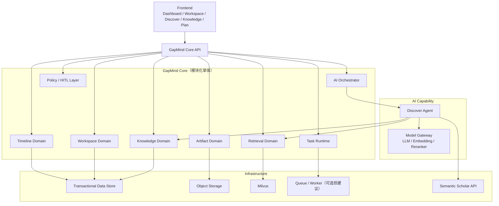
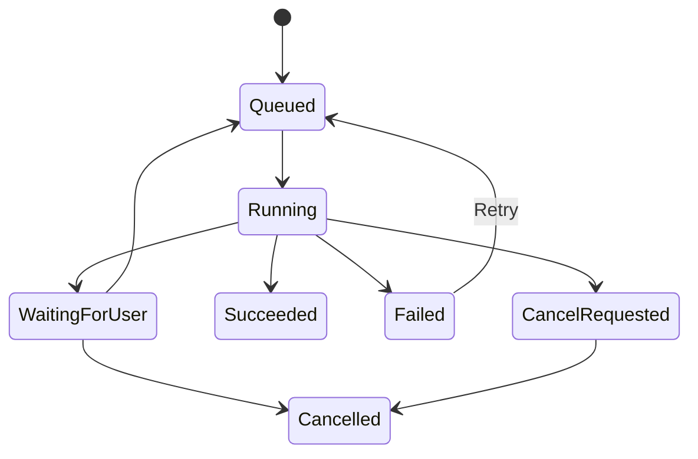

# GapMind 开发计划

> 版本：MVP v1.0  
> 项目定位：Human-in-the-Loop AI Research Workspace  
> 核心能力：Evidence-grounded Research Opportunity Discovery  
> 目标用户：AI/CS 领域研究者，重点为硕博生与早期科研人员  
> 初始研究领域：GNN，重点聚焦 Self-Interpretable GNN

---

## 1. 项目愿景与边界

### 1.1 产品愿景

GapMind 是一个面向科研生命周期的 AI Research Workspace。

它不要求研究者遵循固定工作流，也不承诺自动完成科研。用户可以从论文导入、研究主题探索、实验分析、论文写作或审稿回复等任意入口进入；系统会将论文、知识、实验、研究机会、计划、写作资产和用户决策持续沉淀到 Workspace 中。

系统的核心价值是：

> 将碎片化的科研活动组织为可追溯、可验证、可持续积累的 Research Intelligence。

### 1.2 MVP 的北极星能力

MVP 不以“覆盖所有科研环节”为核心目标，而以如下闭环为核心：

```text
Research Topic / Papers
        ↓
Paper Parsing + Structured Fact Extraction
        ↓
Knowledge Graph + Evidence Retrieval
        ↓
Evidence-grounded Opportunity Discovery
        ↓
Human Confirmation
        ↓
Research Question / Hypothesis / Validation Plan
        ↓
Writing Asset / Timeline / Workspace Memory
```

其中最关键的产物是 `Research Opportunity`：

- 不是单篇论文 Future Work 的复述；
- 不是简单的“某领域还没有人做”；
- 必须有多篇论文证据；
- 必须呈现相似工作；
- 必须呈现反证、重叠工作或风险；
- 必须能转化为可验证的研究问题和研究计划；
- 必须由用户确认、修改、延后或拒绝。

### 1.3 MVP 不做什么

以下内容明确不属于 MVP：

```
- 不承诺自动完成科研；
- 不强制用户按 Discover → Plan → Validate → Synthesize 使用系统；
- 不自动运行任意 GitHub Repository；
- 不构建通用 GPU 调度平台；
- 不构建微服务集群；
- 不让 LLM 输出自动成为长期事实；
- 不依赖 GNN 才能产生核心价值；
- 不构建大规模通用学术知识图谱；
- 不支持复杂多人协作、团队共享知识或企业权限；
- 不实现 Zotero、Notion、Overleaf 集成；
- 不实现 MCP Server；
- 不实现多个自主 Agent 的协商、辩论或自治通信。
```

------

## 2. 产品定位与核心叙事

### 2.1 一句话定位

> GapMind 是一个面向 AI/CS 研究者的 Human-in-the-Loop AI Research Workspace，通过结构化科研知识、证据链、相似工作与反证分析，帮助研究者发现并验证可信的研究机会。

### 2.2 比赛叙事

GapMind 不是一个“自动替人做科研”的 Agent，也不是“多个 LLM 页面功能的集合”。

GapMind 的区别是：

```
普通 AI 文献工具：
论文 → 总结 / 问答 / 写作

GapMind：
论文 → 结构化事实 → 知识关系 → 支持证据与反证
→ Research Opportunity Proposal → 人工确认
→ 研究问题与验证计划 → 后续实验和写作资产
```

### 2.3 Demo 成功标准

比赛 Demo 应证明：

> 用户输入一个研究主题或导入若干论文后，GapMind 能构建可视化知识关系，输出带有多篇证据、相似工作和反证分析的 Research Opportunity；用户确认后，系统将其转化为可编辑研究计划，并在 Workspace Timeline 中完整记录研究过程。

------

## 3. MVP 用户与典型入口

### 3.1 目标用户

初始目标用户：

- AI/CS 领域硕士、博士生；
- 正在阅读、探索或准备开展 AI/ML/GNN 研究的人；
- 有一定 Python、PyTorch 或实验基础的研究者；
- 需要从大量论文中识别研究机会、梳理方法差异和制定验证计划的用户。

初始垂直领域：

```
AI / Machine Learning
└── Graph Neural Networks
    └── Self-Interpretable GNN
```

### 3.2 MVP 支持的用户入口

| 入口                 | 用户输入                      | 系统首要动作                              | MVP 优先级 |
| -------------------- | ----------------------------- | ----------------------------------------- | ---------- |
| 研究主题探索         | Topic、关键词、研究约束       | Semantic Scholar 搜索、论文候选、Discover | P0         |
| 论文导入             | PDF、论文链接或元数据         | 解析、索引、知识抽取、图谱更新            | P0         |
| Knowledge Base       | 已有论文与知识对象            | 搜索、筛选、关系浏览、证据定位            | P0         |
| Research Opportunity | 用户选择一个候选机会          | 确认、编辑、生成计划                      | P0         |
| Plan                 | 已确认 Opportunity            | 生成问题、假设、baseline checklist        | P1         |
| Execute              | Repo、论文或已有实验产物      | Reproduction Checklist、实验记录          | P1         |
| Analyze              | 实验日志、指标、图表          | 解释结果、发现异常、建议验证              | P2         |
| Publish              | 已确认 Claim、Evidence、Draft | 大纲、段落、引用建议                      | P2         |
| Respond              | Reviewer Comments、Draft      | 回复策略和修订计划                        | P3         |

------

## 4. 总体开发策略

### 4.1 架构策略

MVP 使用模块化单体架构，而不是微服务架构。

```
一个 GapMind Core Backend
├── Workspace Domain
├── Knowledge Domain
├── Artifact Domain
├── Retrieval Domain
├── Timeline Domain
├── Task Runtime
├── AI Orchestrator
├── Discover Agent
├── Model Gateway
└── Infrastructure Adapters
```

逻辑模块必须边界清晰，但第一版可以部署为一个后端应用加一个异步 Worker。

### 4.2 核心原则

```
Workspace 是研究上下文和资源归属中心；
Knowledge 是可检索、可关联、可追溯的知识中心；
Artifact 是所有文件和生成产物的统一载体；
Task 是所有长时间工作的运行时容器；
Timeline 是自动生成的研究活动历史；
Agent 只能提出候选，不应直接写入关键事实；
Human-in-the-Loop 决定关键研究结论是否生效；
Knowledge Graph 是逻辑模型，不要求 MVP 使用图数据库；
GNN 是未来可插拔的排序或推理能力，不是 MVP 依赖。
```

------

## 5. MVP 系统架构

````

````

------

## 6. 核心领域模块开发计划

### 6.1 Workspace Domain

#### 目标

提供所有科研资产的归属边界、研究上下文和用户工作空间。

#### MVP 必须支持

```
- 创建 Workspace；
- 编辑 Workspace 基础信息；
- 设置研究主题、目标与约束；
- 关联论文、知识、Opportunity、Plan、Artifact、Task；
- 浏览 Workspace 内的 Timeline；
- 保存 Workspace Memory；
- 单用户访问控制。
```

#### Workspace 核心对象

```
Workspace
├── Research Profile
│   ├── Research Topic
│   ├── Keywords
│   ├── Goals
│   ├── Constraints
│   └── Active Questions
├── Paper References
├── Knowledge Links
├── Opportunity Links
├── Research Plans
├── Tasks
├── Agent Runs
├── Timeline Events
├── Artifact References
└── Workspace Memory
```

#### MVP 验收标准

- 用户可以创建一个以 Self-Interpretable GNN 为主题的 Workspace；
- 用户可以向该 Workspace 导入论文或搜索结果；
- 所有后续的任务、知识、Opportunity 都可回溯到所属 Workspace；
- Workspace 页面能够展示最近活动、已导入论文、待确认 Opportunity。

------

### 6.2 Artifact Domain

#### 目标

统一管理 PDF、解析文本、报告、实验日志、图表、草稿等不可变文件或内容产物。

#### MVP 必须支持

```
- 上传 PDF；
- 记录原始文件；
- 生成解析文本产物；
- 记录文件来源；
- 将 Artifact 关联到 Workspace、Paper、Task 和 Agent Run；
- 记录解析状态；
- 支持版本与 hash 去重的基础能力。
```

#### MVP 验收标准

- 用户上传 PDF 后，系统生成可访问的原始文件 Artifact；
- 解析后的文本能作为独立 Artifact 保存；
- 每个 Artifact 都可以追溯来源任务和所属 Workspace；
- 论文解析失败时，任务和 Timeline 中有清晰状态。

------

### 6.3 Knowledge Domain

#### 目标

将论文、方法、任务、数据集、实验、Claim、Evidence、Limitation、Future Work 等统一为可关联知识对象。

#### MVP 必须支持的 Knowledge Type

```
Paper
Method
Task
Dataset
Metric
Baseline
Claim
Evidence
Limitation
Future Work
Idea
Opportunity
Research Question
Hypothesis
Research Plan
Citation
Note
Code Repository
```

#### Knowledge Item 必备语义

```
- Type：知识对象类型；
- Canonical Name：规范名称；
- Content：结构化内容或摘要；
- Source Provenance：来源；
- Evidence References：证据位置；
- Confidence：置信度；
- Verification Status：候选、已确认、被拒绝、已废弃；
- Scope：Workspace 私有或未来可扩展的全局范围；
- Version：版本；
- Created By：User / Agent / System。
```

#### 状态模型

```
Raw Source
→ Extracted Candidate
→ Evidence-backed Proposal
→ Human-confirmed Knowledge
→ Experiment-validated Evidence
→ Deprecated / Rejected / Invalidated
```

#### MVP 验收标准

- 从论文中抽取 Method、Task、Dataset、Claim、Limitation、Future Work；
- 每个关键抽取结果可回到论文中的证据片段；
- 用户可以确认、编辑、拒绝候选知识；
- 已确认和候选知识在 UI 中可明确区分。

------

### 6.4 Knowledge Graph

#### 目标

构建可解释的研究知识关系网络，用于图谱可视化、相似工作检索、反证发现和 Opportunity 生成。

#### MVP 图谱原则

MVP 只需逻辑知识图谱，不必部署 Neo4j 或其他图数据库。

可先使用：

```
Knowledge Item
+ Explicit Relation
+ Evidence Reference
+ Relation Confidence
+ Relation Status
```

#### MVP 节点类型

```
Paper
Method
Task
Dataset
Metric
Claim
Evidence
Limitation
Future Work
Opportunity
Research Question
Hypothesis
```

#### MVP 关系类型

```
Paper --proposes--> Method
Paper --addresses--> Task
Paper --evaluates_on--> Dataset
Paper --compares_with--> Method
Paper --reports--> Result
Paper --claims--> Claim
Paper --mentions_limitation--> Limitation
Paper --suggests--> Future Work
Method --extends--> Method
Method --compares_with--> Method
Evidence --supports--> Claim
Evidence --qualifies--> Claim
Evidence --contradicts--> Claim
Opportunity --derived_from--> Evidence
Opportunity --related_to--> Method / Task / Dataset
```

#### MVP 图谱可视化

可视化应优先服务于科研判断，而不是展示复杂网络。

必须支持：

```
- 从一篇 Paper 展开其 Method、Task、Dataset、Claim；
- 从一个 Opportunity 查看支持证据；
- 查看相似 Method / Related Work；
- 查看反证、冲突或重叠工作；
- 点击节点后跳转到论文、证据片段或 Opportunity 详情；
- 通过颜色区分 Candidate、Confirmed、Rejected 状态。
```

#### MVP 验收标准

- 至少能可视化 10 篇以上 Self-Interpretable GNN 相关论文的关系；
- 能展示一个 Opportunity 与至少 2–3 篇证据论文的关系；
- 能展示至少一项相似工作或潜在反证；
- 所有关键关系均可追溯来源。

------

### 6.5 Retrieval Domain

#### 目标

实现基于 Milvus 的论文、证据、知识对象检索，为 Discover 和 Knowledge Base 提供可信上下文。

#### 技术决策

```
Vector Database：Milvus
Initial Corpus：Semantic Scholar metadata + Paper PDF parsed text
Language Scope：英文文献
```

#### MVP 必须支持

```
- PDF 文本分块；
- Embedding；
- 写入 Milvus；
- Workspace Scope Filter；
- Top-k 文本检索；
- Metadata Filter；
- 检索结果回链到 Paper 和 Evidence Span；
- 对相似论文与反证论文进行专门检索。
```

#### 检索流程

```
Workspace Scope Filter
→ Topic / Keyword Retrieval
→ Vector Retrieval
→ Metadata Filtering
→ Similar Work Retrieval
→ Counter-Evidence Retrieval
→ Rerank（可选）
→ Context Assembly
```

#### MVP 验收标准

- 用户能对 Workspace 内论文提问并获得有证据定位的回答；
- Discover Agent 能召回主题相关论文；
- 系统能针对候选 Opportunity 主动检索相似工作；
- 系统能返回可能削弱 Opportunity 新颖性的论文或证据。

------

### 6.6 Timeline Domain

#### 目标

自动记录研究活动、Agent 行为、任务状态和用户决策，体现 Workspace 而非固定 Workflow 的产品定位。

#### MVP 事件分类

```
Workspace
Paper
Artifact
Knowledge
Graph
Discover
Opportunity
Plan
Task
Agent
Human Decision
System
```

#### 关键事件

```
workspace.created
paper.imported
paper.parsed
paper.indexed
knowledge.extracted
knowledge.proposed
knowledge.confirmed
knowledge.rejected
graph.relation_created
task.created
task.started
task.completed
task.failed
agent.run_started
agent.output_proposed
opportunity.generated
opportunity.confirmed
opportunity.rejected
plan.generated
plan.confirmed
human.decision_recorded
```

#### MVP 验收标准

- 上传论文后，Timeline 自动出现导入、解析和索引事件；
- Discover 输出 Opportunity 后，Timeline 记录生成事件；
- 用户确认或拒绝 Opportunity 后，Timeline 可显示决策、修改内容和关联对象；
- Timeline 可跳转回论文、证据、Opportunity 或 Plan。

------

### 6.7 Task Runtime

#### 目标

承载 PDF 解析、Embedding、知识抽取、图谱构建、Discover 等耗时任务。

#### MVP 必须支持

```
- 创建任务；
- 任务类型；
- 状态；
- 任务进度；
- 结构化日志；
- 错误信息；
- 产物关联；
- 与 Timeline 关联；
- 基础重试；
- 支持 WaitingForUser；
- 支持取消标记。
```

#### 状态机

````

````

#### 是否引入消息队列

建议在 MVP 使用轻量异步任务队列。

原因：

- PDF 解析、Embedding、Discover 不能放在同步 HTTP 请求中；
- 前端需要进度更新；
- 用户需要知道任务成功、失败或等待确认；
- 后续模型调用和计算量增加后可独立扩展 Worker。

可选方向：

```
优先：Redis + Celery / Dramatiq / RQ
暂不使用：Temporal、Airflow、Argo Workflows 等重型系统
```

具体框架可以在实施时根据团队熟悉度选择；架构上必须具备 Task Runtime。

------

### 6.8 Model Gateway

#### 目标

统一管理 LLM、Embedding 与未来本地模型调用，支持多模型路由、可观测性与后续微调。

#### MVP 必须支持

```
- 根据任务类型选择模型；
- 统一 Prompt 版本；
- 记录模型与版本；
- 记录 token、时延与成本；
- 支持结构化输出；
- 支持 Embedding 模型版本化；
- 支持未来新增本地模型 Provider。
```

#### 模型路由原则

| 任务           | 优先要求                   |
| -------------- | -------------------------- |
| 论文结构化抽取 | 稳定的结构化输出、低随机性 |
| Evidence       |                            |

